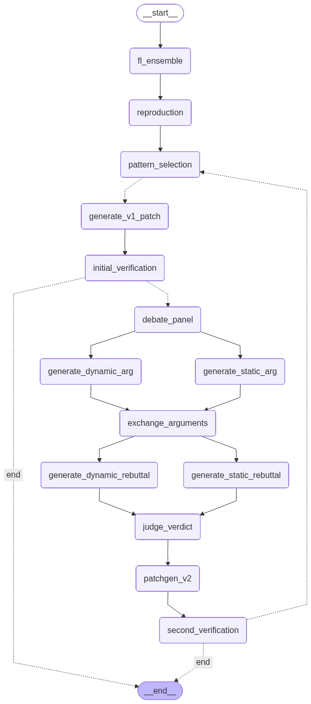

# ♠️ SPADE: Semantic Pattern-Guided LLM-Based Multi-Agent DebatE for Automated Program Repair

[](#) [](https://www.python.org/downloads/) [](https://opensource.org/licenses/MIT) [](https://github.com/langchain-ai/langgraph) 

SPADE is an LLM-based multi-agent framework designed for Automated Program Repair (APR). 

---

## 1. Quick Start

### 1.1 Environment Setup
Clone the repository and run the setup script to initialize the virtual environment and install dependencies.
```bash
# Make the script executable 
chmod +x setup.sh

# Run the setup script
./setup.sh
```

### 1.2 Run the Evaluation
```bash
# Activate the virtual environment (if setup.sh doesn't do it automatically)
source .venv/bin/activate

# Start the evaluation
python main.py
```

## 2. LLM Configuration

By default, SPADE is configured to run locally and entirely for free. The framework uses `qwen2.5-coder:latest` via Ollama as the default LLM for all agents out of the box.

### 2.1 Local Setup (Default)

To run the default configuration, you will need to install Ollama and download the Qwen model:

- Install Ollama: Download and install Ollama from [ollama.com](https://ollama.com/).

- Download the Model: Open your terminal and run the following command to pull the model:
```bash
ollama pull qwen2.5-coder:latest
```

- Start the Server: Ensure the Ollama application is running in the background. The server runs locally on http://localhost:11434.

### 2.2 Overriding Defaults

You can setup LLM models, adjust temperatures, and configure endpoints for specific agents without modifying the source code. Simply edit the config/llm.yaml file:
```yaml
agents:
  pattern_selection:
    provider: "gemini"
    model: "gemini-2.5-flash"
    temperature: 0.0
    base_url: "https://generativelanguage.googleapis.com/v1beta/openai/"
    api_key_env: "GEMINI_API_KEY"
  judge:
    provider: "openai"
    model: "gpt-4o"
    temperature: 0.0
    base_url: null
    api_key_env: "OPENAI_API_KEY"
```

Depending on the cloud providers, you must set the corresponding environment variables before running the evaluation. You can export them directly in your terminal:

```bash
export OPENAI_API_KEY="[your-openai-api-key]"
export GEMINI_API_KEY="[your-gemini-api-key]"
```

## 3. SPADE Orchestration



## 4. Tips & Troubleshooting
### 4.1 Resetting Agent Memory

SPADE uses a local SQLite checkpointer to persist agent state and memory across runs. To completely clear the memory and start fresh:

```bash
# Delete the local checkpointer database to clear agent memory
rm data/checkpoints.sqlite*
```

### 4.2 Viewing Execution Traces
Detailed, timestamped execution logs, including token consumption and reasoning traces, are automatically saved to the data/logs/ directory for every run.
